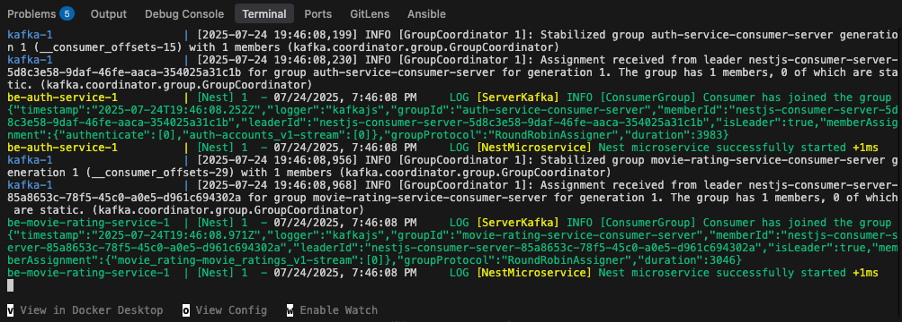
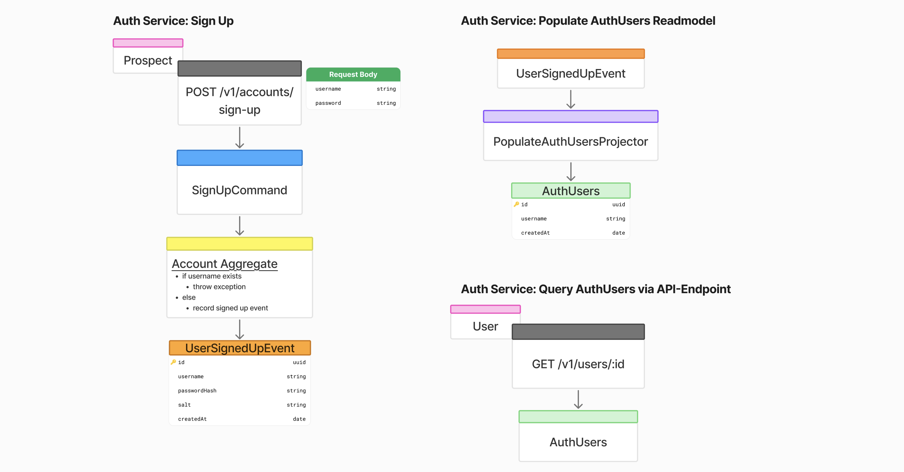

# 🍿🎬 Movie Rating Backend Monorepo

## Table of Contents

- [Setup](#setup)
- [Swagger](#swagger)
- [App Structure](#app-structure-nx-graph) 
- [Design Choice](#design-choice)
- [Planning](#planning)
    - [Big Picture Event Storming](#big-picture-event-storming)
    - [Design Level Event Storming](#design-level-event-storming)
- [Test Coverage](#test-coverage)
- [Todo](#todo)

## Setup
1. Clone the repository
2. From repository root, run: ```docker compose up```
3. Wait for start up till it looks like this:




Apps are served under:
- https://localhost:3000/api - Auth Service
- https://localhost:3001/api - Movie Rating Service

Each Database can be accessed under following config:
- host: localhost
- user & pw: root
- database: postgres
- port:
    - 5432 - Event Store
    - 5433 - Auth DB
    - 5434 - Movie Rating DB

Note: `POST /sign-up` and `/movie-rating` return the created ID in the header


## Swagger
Once the setup is running, the contracts are served on:
- http://localhost:3000/api/docs - for auth api
- http://localhost:3001/api/docs - for movie-rating api

## App Structure (Nx Graph)
This monorepo consists of two apps/microservices and two shared libraries, both of which are used in the apps. 

Screenshot from interactive NX Graph UI after running ```nx graph``` (but can only be run, if workspace dependencies are installed by running ```npm install```)

## Design Choice
In order to implement a scalable and maintainable software, its crucial to follow principles and design patterns that enable/enforce the implementation of clean and flexible architectures. Thats why I opted for a microservice-architecture and for dividing the software into multiple components, but this approach also enables us to apply Domain-Driven Design. Based on that there are already clear boundaries not only on technical level but also on business-domain level within the software.

Another applied concept is CQRS which enforces the vertical slicing within an application and enforces independent implementation of use cases, also providing flexibility if requirements change and fewer side-effects, when changing existing code.

In terms of communication between the apps and the synchronzisation of the Read and Write Model in CQRS, I opted for the implementation of Event Sourcing which enables us to save all relevant business events and use them to project any state in time or to rebuild the current state. It generally serves two purposes: saving information and maintaining a history of things that happened, that can be interpreted and shown anywhere anytime.

## Planning
### Big Picture Event Storming
All relevant events in the auth & movie rating domain

### Design Level Event Storming
Below some event maps for specific use cases (not all shown here):

Sign up


Movie rating creation


Access movie ratings


Update movie rating stars


Delete movie rating


## Test Coverage

Showing the test coverages requires nx workspace dependencies and running ```npm install```.

All projects are unit tested except the boilerplate library.

Run unit tests:
```bash
nx test be-auth-service --coverage
nx test be-movie-rating-service --coverage
nx test domain --coverage
```

Open coverage (index.html) accordingly:
```bash
open coverage/apps/be-auth-service/index.html
open coverage/apps/be-movie-rating-service/index.html
open coverage/libs/domain/index.html
```

Auth Service Coverage


Movie Rating Service Coverage


Domain Library Coverage


## Todo
- Implement IMDB-API
    - add a `GET-endpoint` to the movie rating service to `query IMDB movies` by title using the IMDB-Client
    - modify `POST /movie-rating` to include a `imdbID property` to map the movie rating to an actual movie
    - when fetching movie ratings of a user, `imdbID` can be used to fetch more information about the movie and the `film poster`
- Add migration setup to not use the automatic synchronization mechanism by TypeORM & to enable event (stream) versioning
- Write unit tests for boilerplate lib
- Write integration & E2E tests for Auth & Movie Rating Services
- Setup CI/CD workflow, to run builds & unit/integration/e2e tests
- Integrate code analysis/sniffing tools like Sonarqube or better error logging tools like Sentry